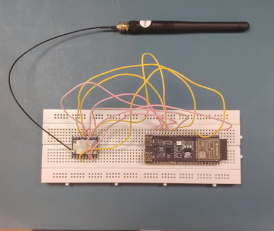
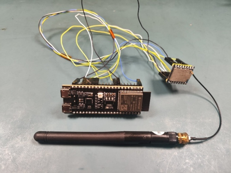

<h1>26NUSDEEP12 Project - Evaluating Adaptive LoRa Hyperparameter Selection Algorithms for Doppler-robust Low-cost LEO Communication Links (UNDER DEVELOPMENT)</h1>
 
<h2>Research Question</h2>
How effectively can adaptive LoRa spreading factor and bandwidth selection improve performance under severe Doppler-induced frequency offset in low-cost LEO communication links?
 
<h2>Notes: </h2>
<ul>
  <li>Before running, start a Python virtual environment and install all required Python libraries</li>
  <li>To load a new/existing database, simply type its name when running main.py</li>
  <li>Our own experimentation data is also available in the ??? folder for reference. Do note that Phase 1 SF 7 62.5 kHz has been deliberately left out as it cannot achieve a successful link at all.</li>
  <li>A total of 2 ESP-32 S3 Devkit-C1 boards with the Core 1121-HF LoRa module are required along with two computers with USB ports, and this project is run in VS Code with the PlatformIO extension.</li>
  <li><b>Important!</b> When flashing code onto the ESP-32 board, ensure the target file is in the src folder of the LoRa Satellite Simulation folder. In addition, make sure no other .cpp files are in the src folder.</li>
  <li>When plugging in the "satellite", it will have a yellow light turned on, meaning that it is on standby. The light should turn off when the BOOT button is pressed, meaning the "satellite" is starting its pass.</li>
  <li>In order to start the LEO pass, click "Start Recording" for the "satellite" <b>ONLY</b> first and then click the BOOT button on the "satellite" and the "Start Recording" button for the <b>"ground station"</b> simultaneously.</li>
</ul>
<h2>Hardware setup:</h2>
<b>For the ESP-32 'satellite', the pins are as follows:</b>
  
<table>
  <thead>
    <tr>
      <th>ESP32 Pin</th>
      <th>Core 1121 HF Pin</th>
    </tr>
  </thead>
<tbody>
  <tr>
    <td>GPIO12</td>
    <td>CLK</td>
  </tr>
  <tr>
    <td>GPIO13</td>
    <td>MISO</td>
  </tr>
  <tr>
    <td>GPIO11</td>
    <td>MOSI</td>
  </tr>
  <tr>
    <td>GPIO10</td>
    <td>CS</td>
  </tr>
  <tr>
    <td>GPIO15</td>
    <td>RST</td>
  </tr>
  <tr>
    <td>GPIO9</td>
    <td>BUSY</td>
  </tr>
  <tr>
    <td>GPIO16</td>
    <td>DIO9</td>
  </tr>
  <tr>
    <td>3.3V</td>
    <td>3.3V</td>
  </tr>
  <tr>
    <td>GND</td>
    <td>GND</td>
  </tr>
</tbody>
</table>

<b>For the ESP-32 'ground station', the pins are as follows:</b>
 
<table>
  <thead>
    <tr>
      <th>ESP32 Pin</th>
      <th>Core 1121 HF Pin</th>
    </tr>
  </thead>
<tbody>
  <tr>
    <td>GPIO12</td>
    <td>CLK</td>
  </tr>
  <tr>
    <td>GPIO13</td>
    <td>MISO</td>
  </tr>
  <tr>
    <td>GPIO11</td>
    <td>MOSI</td>
  </tr>
  <tr>
    <td>GPIO10</td>
    <td>CS</td>
  </tr>
  <tr>
    <td>GPIO14</td>
    <td>RST</td>
  </tr>
  <tr>
    <td>GPIO9</td>
    <td>BUSY</td>
  </tr>
  <tr>
    <td>GPIO16</td>
    <td>DIO9</td>
  </tr>
  <tr>
    <td>3.3V</td>
    <td>3.3V</td>
  </tr>
  <tr>
    <td>GND</td>
    <td>GND</td>
  </tr>
</tbody>
</table>
  
Below is the photo of our 'ground station' ESP-32 for reference:   

  
And this is the photo of our 'satellite' ESP-32 for reference:   

  
(Either female wires or a breadboard with male wires can be used.)
